# Hardware (Electronics)

This subfolder contains the basic electrical circuit details used
in building the teensyExpression Box.

Physically, the most demanding task was to build the **switch array**, with 25 little
circuit boards, and 25 LED's to connect together in a grid.  Each LED is connected into
a series by 3 wires ... in two directions ... ground, 5V, and data in / data out from the
first, to the last LED.  A single 3 pin connector connects all 25 LED's to the teensy
(motherboard) and power supply.

The switch harness, overlayed on top of LED serial connections, consists of the 25
buttons connected (soldered) together into a 5x5 grid that presents itself
as two 5 pin connectors to the *motherboard*.

[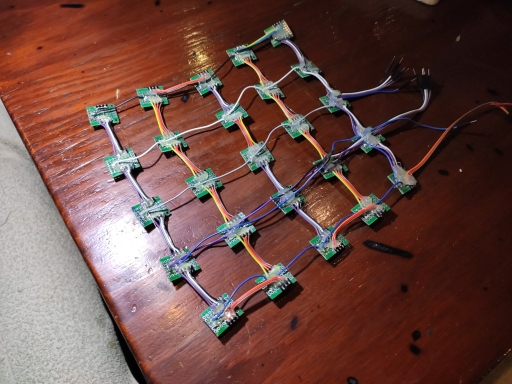](../images/teensyExpression12.jpg)

The **motherboard** is a 70x50 mm prototype board that has a socket (two rows
of female header strips) into which a teensy 3.6 is plugged,
and which has connectors (female header strips) for the LEDs, switches,
rotary controls, serial port, TFT LCD display. The host USB port connector
is on the teensy 3.6 board itself.

Virtually every pin on the teensy was used in this
exersize, at the sacrifice of future expandability, but the gain of simplicity in the
circuit design.  Previous design iterations had used IO multiplexer chips, for example,
to communicate with the swtich array, via 4 pins, instead of 10, but in the end I just
decided to let the teensy handle all 10 pins from the switch array in favor of a simpler
electronic circuit.

[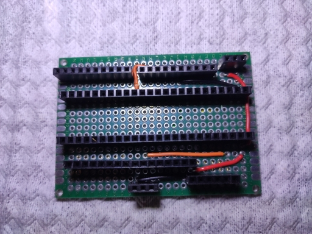](../images/teensyExpression13.jpg)

The TFT/touchscreen is connected to the motherboard through two 8 pin connectors.

[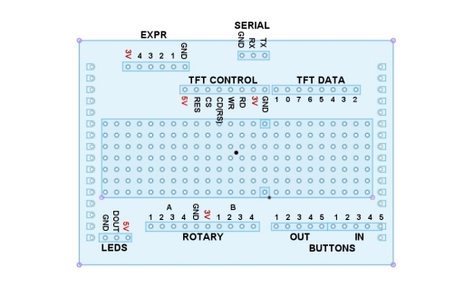](circuit_pinouts.jpg)

Besides those three main components, there are separate subassemblies
and/or circuit boards for the four **rotary countrollers**,
the **USB port and amp-meter**, the **serial port connector**, and, finally,
the back panel with it's **four expression pedal 1/4" stereo jack inputs**.

I have not made a real **schematic** for this project.  But the diagrams below,
of the motherboard, sub-assemblies, and connectors, along with the C++ source
code in ../arduino/teensyExpression which also specifies the teensy pinouts,
should be sufficient for any interested part to reconstruct this project.
I *may* yet create a schematic for this, although I am as likely to start another
whole box, this time based on a teensy 4.1, which is faster and more powerful
than the teensy 3.6.

## LED/Switch Array

Each switch array circuit board contains a swtich and a ws2812b addressable LED.
The LEDs are wired back together with three wires between each one, in a series,
starting from the top left position, row-wise, back and forth, so the last LED
is at the bottom right.

[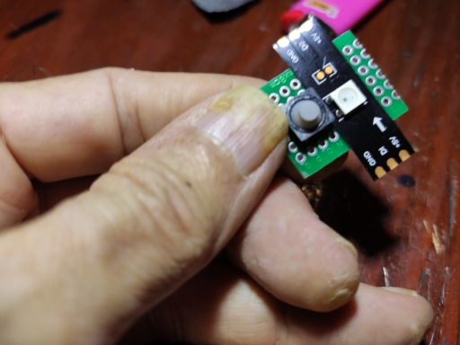](../images/teensyExpression10.jpg)

I cut the 25 wa2812 LED's from an inexpensive light strip that can be had for
as little $2, with shipping, on ebay.

The strip I used has 30 LEDs, with 30mm spacing, and with capacitors on about
every 8th LED. So one small strip was sufficient to make the box.

The switch circuit boards were cut to 20x25 mm from commonly available
20x80mm prototype boards that cost about 60 cents each on ebay.  I bought
them as part of a pack which included some other sizes for something
like $8.   With care 3 of switch-boards can be cut from each prototype board,
and, since 25 are needed, you'd need 9 of the prototype boards to reproduce
this project.

[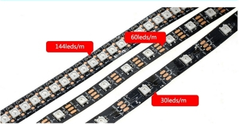](https://www.ebay.com/itm/5V-WS2812B-Led-Strip-Waterproof-IP65-IP67-30Leds-m-60Leds-m-5M-Neon-5V-Led-light/383642094481)
[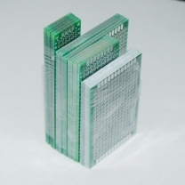](https://www.ebay.com/itm/20pcs-PCB-Prototype-Board-Circuit-Stripboard-2X8-3X7-4X6-5X7-5Pcs-Each-Veroboard/252520067657)

*click on images above to see them in ebay*

I had already decided to make the buttons have a 45 mm spacing, a little larger,
and with a little more space than the drum pads on an akai MPD218 (typical
midi drumpad device).   The LED strips have a 30 mm spacing ... and so, after some
consternation ... I opted for the demanding task of cutting the strip apart and
then soldering it back together.

I tried to uniformely distribute the LED capacitors throughout the harness.

The switches are soft silicon with momentary contacts.  They seemed to provide
enough spring back to work, and they work fine in practice.   I found them
available on ebay for $1.85 for 20 (so you'd need two packs, but have 15 left
over at the end).

[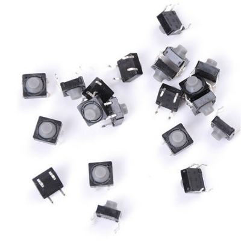](https://www.ebay.com/itm/20pcs-8x8x5MM-4PIN-Tactile-Push-Button-Micro-Switch-Direct-Self-ResetSoundlessHY/313082729862)

*click on image above to see in ebay*

To complete the circuit boards I put a drop of super glue on the back of each
LED piece, held it on the circuit board, and bent the connectors around to the
back, trying to keep it as close as possible (centered) to the switch, which
occupies a 2x3 footprint on the board.

The switches are wired together in an array, with columns connnected to one pin of
each switch and rows connected the other pin of each switch.  Rows start at the
top and go down, and columns start at the left and go to the right.  These wires
end in two connectors which are called OUT (columns) and IN (rows) which plug
directly into the motherboard.  If you get em backwards, you merely have to change
the IN and OUT defines in the source code.

## Mother Board

The circuitry on the **motherboard** is pretty simple.  Most of it was
connected by using female headers with long leads and bending the leads
and connecting direclty to another header.

Here are two diagrams that show, respectively, the wiring for the back,
and the front of the circuit board.   The solid lines are made either
by bending leads and soldering them, or by running beads of solder
over multiple holes in the prototype board. The lighter blue lines
are wires that are soldered from one point to another.

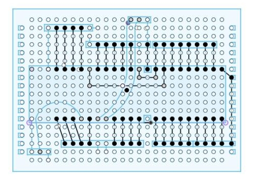

*above, motherboard back (as seen from the front)*

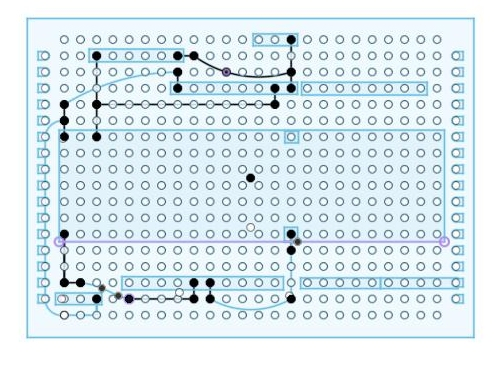

*above, motherboard front*

## TFT Touch Screen

The Touchscreen is connected directly to the motherboard by two 8 pin
dupont female to male cables.

[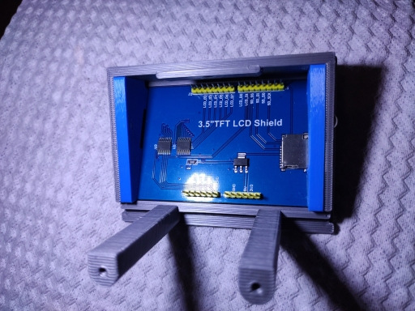](../images/teensyExpression15.jpg)

The pinouts are detailed in previous diagrams.

## Rotary Encoders

I didn't take any pictures, or keep any detailed design description of the
Rotary Encoder board I threw together. So I would have
to open the box up and disassmble it to present it properly.

TODO: Open up the friggin box and take pictures of the rotary controler board.

I am not using the momentary switches on the rotary encoders.
They were kind of an afterthought, and I had no more pins available on
the teensy by that point in the hack/implementation.

As I remember, I did not put any resistors or capacitors on it, I just wired
the ground to the ground pin for the momentary switch (don't even think it'sda
used), the 3.3V to the center pin on the rotary part of the things (the side with
three pins), and the pairs of connectors (IN and OUT) to the left, and right
pins on that side of the things.

If you get it wrong you merely have to change the definitions of the IN
and OUT pins in the source code.

## USB Port and Amp Meter

During earlier prototyping, and in general, I was curious about the power
consumption of the device, and so had taken to using an inexpensive USB
power meter to monitor the power usage.

These power meters are available on Ebay for about $7.

[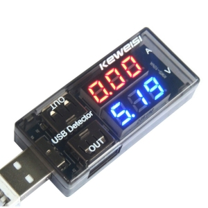](https://www.ebay.com/itm/USB-Charger-Doctor-Voltage-Current-Meter-Mobile-Battery-Tester-Power-Detector/401708239662)

*click on the image to go to ebay*

I merely desoldered the USB connectors, and connected the ground and 5V from
the main input USB type A port to it, and ran it back to the micro-usb connnector
that connects to the teensy.

[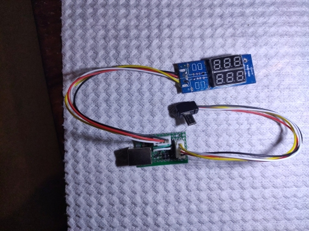](../images/teensyExpression14.jpg)

I was very pleased with these little micro-usb connectors that I also got
on ebay, at 10 for $5.79 (about 60 cents each)

[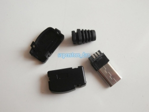](https://www.ebay.com/itm/10X-Micro-Usb-5-Pin-Male-Plug-Socket-Connector-Right-Angle-Long-Head-Cover-Tail/201390419549)

And I needed the female Type A connector as well (probably around $1 on ebay).

What made this step considerably more fun, and easy, was the purchase of some
prewired headers and sockets for 2.54mm circuit boards.  I got 10 of em for
under $4 on ebay, and used to two in this project.  I will definitely use these
more in the future, as I **hate** dupont connectors and trying to build them
from scratch!

[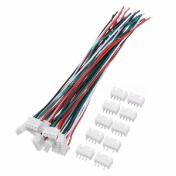](https://www.ebay.com/itm/10-Sets-4-Pin-Micro-JST-XH-2-54mm-24AWG-Connector-Plug-With-Wire-Cables/264781666854)

Once again, I did not make a schematic of the little circuit board itself.
I do know that it is approximately 24x38 mm, and the Type-A USB connector
projects about 3mm through the back of the box.

But it's really simple.  Basically it connects the Type-A female usb port ground and 5V
to an outgoing pair on the connector that goes to the power meter, and the incoming pair
that comes back and is connected to the ground and 5V pins on the outgoing (to
the teensy) micro-usb connector.

[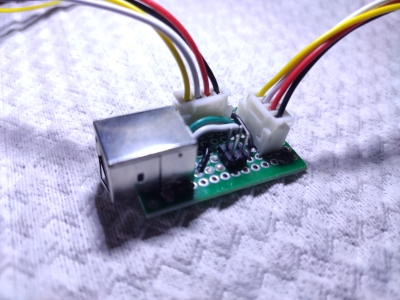](usb_port_board.jpg)

The D- and D+ pins from the TypeA connector are wired directly to the
output connector, and I added a jumper so that, if I want, I can remove
the USB meter and jumper the 5V and ground directly from the input typeA
socket to the output micro-usb connector.

Sorry about the lack of detail here! I am writing this *after* I finished
the hardware aspects of the project, but I think you can figure out how
it goes from this, and other standard information available on the web
about USB connectors.

## Serial Port Connector

The serial port connector is merely a 1/8" stereo jack connected
to a 3 pin dupont connector.   The *tip* of the connector is the
RX into the teensy, the *ring* is the TX from the the teensy, and
the *sleeve* is the ground.

[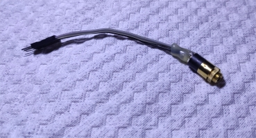](serial_port_jack.jpg)

The female, gold plated, 1/8 stero jack was about $1.50 on ebay.

## Host Port USB connector/board

The host port USB connector board is another 24x20 mm piece of one of the
20x80 prototype boards, with a micro USB female connector at one end, and
a 4 pin dupont connector at the other, that connects to a 4 pin header
soldered onto the teensy 3.6 board.

[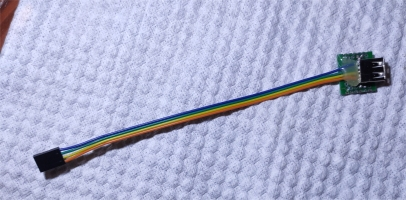](host_port_board.jpg)

The female micro USB connectors are about 30 cents each, when purchased in
lots of 10 on ebay.

## Back Panel and 1/4" Expression Jacks

That leaves the back panel and the four 1/4" expression jacks.

I attached these to the 3D printed back and soldered the wires on in place so-as
to get appropriate lengths of wire with a minimum of fuss.   They are wired with
ground going to the *sleeve* of each connector, 3.3V going to the *ring*, and
the return "sense" pin wired to the *tip*.   The jacks were probably about $1
each on ebay.

After I put it together, I ran into some problems with this part of the build.
Notably, that when you would plug a 1/4" jack into the the things, it would
momentarily short the 3.3V to ground, yikes, rebooting the system.

It is not a good idea to short the 3.3V output from the voltage regulator
on the teensy directly to ground!

Yet I think the connectors are actually designed to avoid doing that by the spacing
of the tip and ring parts of the male vs the contact points of the female jacks.

The final solution was that I put a 1K resistor on the motherboard between the
3.3V output from the teensy and the common 3.3V connectors (*rings*) on the
connectors.   Although that works, by limiting the current that can flow in
the event of a short circuit, it should not have been necessary and I am
still thinking about how to do it correctly (next time!).

# Cost of Electronics Summary

So, as a curiousity, after the fact, I have tallied up the following costs for the
electronics part of the build.   Clearly the most expensive items is the teensy 3.6,
which I got WITH pins from  at: [prjc.com](https://www.pjrc.com/store/teensy36_pins.html).
They are currently $33.25.  Some of the other costs are just estimates, but I think its
pretty close.

| item    | price |
|------|-------|
| Teensy 3.6 pins |  $33.25 |
| USB Power Meter | $7.00 |
| 3.5" Touch Screen |  $5.00 |
| 30 x LED ws2812b strip | $2.00 |
| 25 x push buttons | $2.50 |
| mother prototype board | $3.00 |
| 4 x Rotary Encoder | $4.00 |
| 4 x 1/4" female jacks | $5.00 |
| 1/8" female jack | $1.25 |
| female micro USB connector | $0.50 |
| mother prototype board | $2.50 |
| rotary encoder prototype board | $2.50 |
| 10 x small prototype boards | $10.00 (max) |
| Wired connectors and jacks | $1.00 |
| 5 x 40 pin female headers | $2.50 |
| Wired Dupont Connectors | $4.00 (max) |
| Other Wire | $1.00 |
| Solder, etc | $1.50 |
| **Total** | approx **$88.50** |

It was my goal to try to keep the cost of the project at, about, or under **$100**.
If I figure I used about 1kg of plastic in 3D printing it, at $20/kg,
then, I came close. This box could theoretically be built by anyone with a
3D printer for about $110.

Though I doubt anyone will take my exact design and replicate it, apart
from wanting the box itself, I wanted to prove that it could be made on
a budget, if one is willing to put the effort into it.

Also note that you could eliminate stuff (like the rotary encoders
and the usb power meter) in order to cut the costs a bit. I don't
actually envision using the rotary controllers that much as it is
a floor based *foot* pedal.

For me it is replacing a $270 Softstep II, a $100 akai MPD218, and
a $170 audio-front expression-to-usb-midi convertor, or nearly $600
of gear ... and three separate devices ... with one consolidated
usb midi device, so in addition to cost factors, for me it also reduces
the complexity of my rig, and the setup and teardown times thereof.

It also provides me with much more flexibility to do what I want, and
have not even yet envisioned, going forward.  More on that in the
software section of the project.

I have not seen any comparable hardware that sells for less than $200.
In fact, a box similar to this would probably retail in the $400-$500
price range, and some go for as much as $1500 to $2000.
I couldn't find what I wanted in the way of a foot controller
for running the FTP in conjunction with SampleTank, Tonestack, and Quantiloop,
on Audiobus, on an iPad, so I built this.

Of course, it took several weeks of 3D design work, prototyping, and
nearly 2 full 40 hour weeks for me just to consctruct the final prototype.
And I'll probably be working on the software for months, or mabye years, more.
Nonetheless, it *might* be something that a typically impoverished musician could
put together.

So, with that, I conclude the "hardware" portion of our show!

Thanks,

**Patrick**
